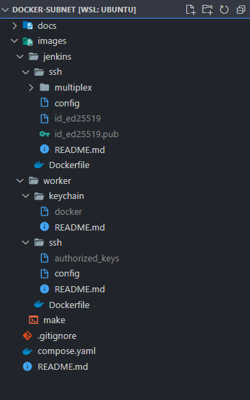
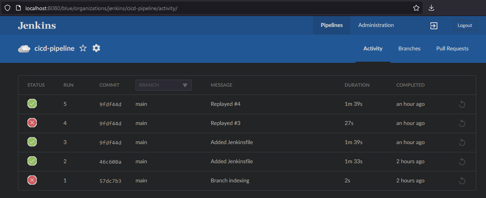
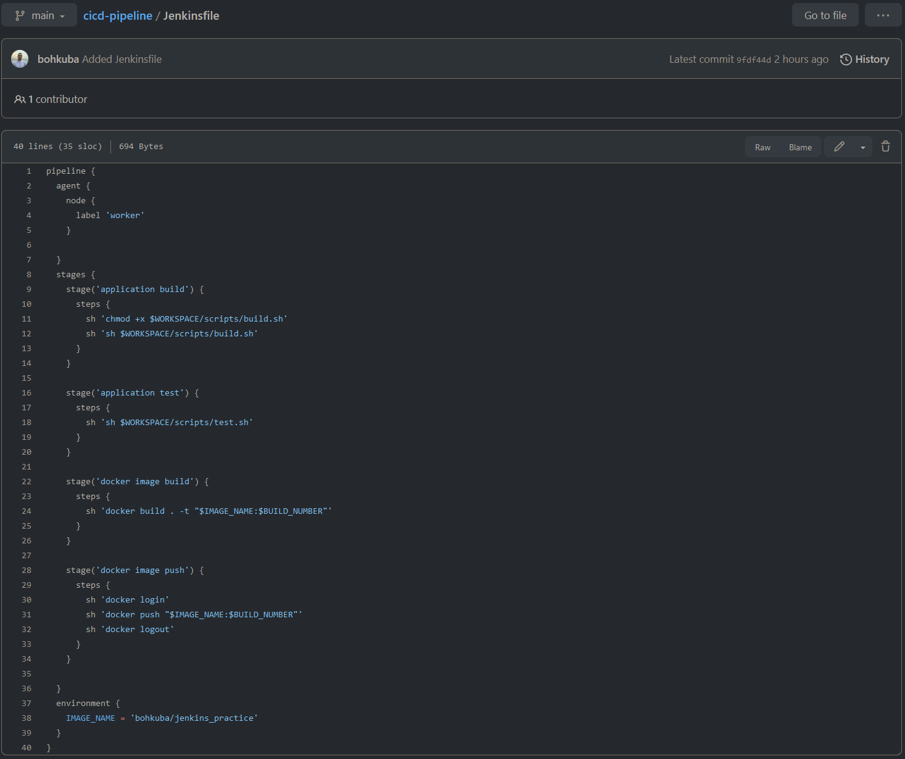

# Jenkins+Worker w/ Docker Alpine Linux Subnet
###### jdk@17, npm@8.10, nodejs@18.9

##### Sibling containers via docker.sock
The stack was created on my local Windows 11 machine using the WSL 2. \
Initially, I was trying to pick up the stack using DinD (Docker-in-Docker), but configuring it from a local machine was quite confusing. \
Scrolling thru a ton of StackOverflow discussions, I decided to downshift and connected containers with host's docker.sock to save some time. \
But the research done has left me deeply interested in creating proper production ready Docker Swarm.

### Bootstap it from bash
* Configure it according to the instructions below
* Run ``` sh images/make ``` to build docker images
* Run ``` docker compose up -d ``` to deploy the stack
* Now you can access Jenkins UI from localhost:8080
* Or login to docker containers' ash (alpine bash) ``` docker compose exec -it [jenkins,worker] ash ```

### Configuration
##### Jenkins container connects to the worker via ssh
  - For this generate an SSH key for jenkins controller
    - ``` ssh-keygen -o -a 100 -b 4096 -t ed25519 -f images/jenkins/id_ed25519 -C "jenkins" ```
  - And authorize it by a worker
    - ``` cat images/jenkins/id_ed25519.pub >> images/worker/ssh/authorized_keys ```
  - Don't forget to create SSH credentials for root user via [Jenkins UI](http://localhost:8080/manage/credentials/store/system/domain/_/newCredentials) using generated private SSH key
##### Worker is responsible for building, packaging and deploying artifacts to the Docker Registry
  - Authorize it to work with docker by creating credentials file under images/worker/keychain/docker
    - Generate Docker Access Token via [Docker Hub UI](https://hub.docker.com/settings/security)
    - Create a ``` docker ``` file with credentials under ``` images/worker/keychain/docker ```
    - File format is ``` registry_name:access_token ```
###### File structure

###### Blue Ocean CI/CD

###### Jenkins Pipeline

